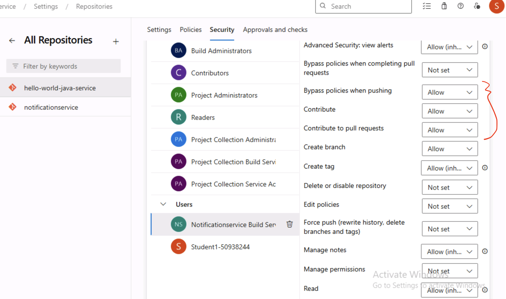
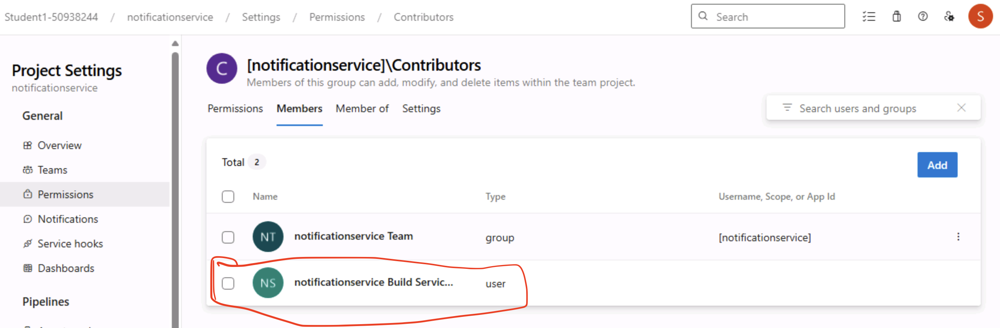

# hello-world-java-service

This repository is meant to be used as a template microservice implemented using [Spring Boot](https://spring.io/projects/spring-boot) framework in Java. The purpose is to have a service which we may easily spin up on an AKS cluster using CI/CD pipelines.

## Running Service Locally
We are using Maven and its wrapper to make life easy. In order to spin-up the service locally, all we need to do is to run the following command:
```bash
./mvnw spring-boot:run
```
The service will be up and running on port `8080`. We may call the service using the following command:
```bash
curl -v http://localhost:8080/hello 
```
If everything goes fine, a `Hello, World!` response should be received.

## Building & Running Docker Image Locally
We are using [jib plugin](https://github.com/GoogleContainerTools/jib/tree/master/jib-maven-plugin) to build container images. In order to build docker image locally, following command need to be executed:
```bash
export ACR=local && ./mvnw clean compile jib:dockerBuild
```

If you are using podman, you may use the following command:
```bash
export ACR=local && mvn jib:dockerBuild -Djib.dockerClient.executable=$(which podman)
```

The above command should publish `local/pe/hello-world-java-service:0-SNAPSHOT`
image to local docker daemon.

The image can then be executed by running:
```bash
docker run -p 8080:8080 local/pe/hello-world-java-service:0-SNAPSHOT
```

If you are running podman
```bash
podman run -p 8080:8080 local/pe/hello-world-java-service:0-SNAPSHOT
```


## Forking repo and running the service in your setup Azure Devops & AKS cluster
In order to run the service in your setup, you need to follow the following steps:

0. The following steps assume that you have already setup Azure DevOps with an organization, project and a repo.

1. Ensure the Azure Container Registry (ACR) is attached to the AKS cluster. You may use the following command to attach ACR to AKS cluster.
```bash
az aks update --name <aks-cluster-name> --resource-group <resource-group-name> --attach-acr <acr-name>
```

2. Clone this repo using the following command:
```bash
git clone https://kmanzoor@dev.azure.com/kmanzoor/aks-demos/_git/hello-world-java-service
```

3. Update the remote URL of the repo to your forked repo. You may use the following command to update the remote URL:
```bash
git remote set-url origin <your-repo-url>
```

4. Update [pipelines/pipelines-ci.yml](pipelines/pipelines-ci.yml) and [pipelines/vars-dev.yaml](pipelines/vars-dev.yaml) files with your specific values for Azure Container Registry (ACR), Service Connection, Resource Group and AKS cluster details. Commit and push the changes to your repo.

5. Create 3 new pipelines and corresponding branching policy in your Azure Devops project. The following commands assume that you have already logged in to your Azure account using `az login` command.

```powershell
$ORG_NAME="<replace with your org name in azure devops>"
$PROJECT_NAME="<replace with your project name in azure devops>"
$REPO_NAME="<replace with your repo name in azure devops>"

$PIPELINES_BRANCH_NAME="main"
$REPO_ID = az repos list `
    --organization "https://dev.azure.com/$ORG_NAME" `
    --project "$PROJECT_NAME" `
    --query "[?name == '$REPO_NAME'].id" `
    --output tsv

$PIPELINE_NAME="hello-world-java-service-commitlint"
$PIPELINE_PATH="pipelines/commitlint-pipeline.yaml"

$RESP = az pipelines create --name $PIPELINE_NAME `
    --description "$PIPELINE_NAME pipeline for $REPO_NAME" `
    --branch $PIPELINES_BRANCH_NAME --yml-path $PIPELINE_PATH `
    --detect --skip-first-run true --organization "https://dev.azure.com/$ORG_NAME" `
    --project $PROJECT_NAME --repository $REPO_NAME --repository-type 'tfsgit'

$PIPE_ID = $RESP | ConvertFrom-Json | Select-Object -ExpandProperty id

$PROTECTED_BRANCH="main"
$BRANCH_POLICY_NAME="conventional-commitlint"
az repos policy build create `
--blocking true --branch $PROTECTED_BRANCH `
--build-definition-id $PIPE_ID `
--display-name $BRANCH_POLICY_NAME --enabled true `
--repository-id $REPO_ID --manual-queue-only false --queue-on-source-update-only false `
--valid-duration 0 --detect true --org "https://dev.azure.com/$ORG_NAME" `
--project $PROJECT_NAME

$PIPELINE_NAME="hello-world-java-service-CI"
$PIPELINE_PATH="pipelines/pipelines-ci.yml"
$RESP = az pipelines create --name $PIPELINE_NAME `
    --description "$PIPELINE_NAME pipeline for $REPO_NAME" `
    --branch $PIPELINES_BRANCH_NAME --yml-path $PIPELINE_PATH `
    --detect --skip-first-run true --organization "https://dev.azure.com/$ORG_NAME" `
    --project $PROJECT_NAME --repository $REPO_NAME --repository-type 'tfsgit'

$PIPE_ID = $RESP | ConvertFrom-Json | Select-Object -ExpandProperty id
$PROTECTED_BRANCH="main"
$BRANCH_POLICY_NAME="hello-world-java-service-CI"
az repos policy build create `
--blocking true --branch $PROTECTED_BRANCH `
--build-definition-id $PIPE_ID `
--display-name $BRANCH_POLICY_NAME --enabled true `
--repository-id $REPO_ID --manual-queue-only false --queue-on-source-update-only false `
--valid-duration 0 --detect true --org "https://dev.azure.com/$ORG_NAME" `
--project $PROJECT_NAME

$PIPELINE_NAME="hello-world-java-service-CD"
$PIPELINE_PATH="pipelines/pipelines-cd.yml"
az pipelines create --name $PIPELINE_NAME `
    --description "$PIPELINE_NAME pipeline for $REPO_NAME" `
    --branch $PIPELINES_BRANCH_NAME --yml-path $PIPELINE_PATH `
    --detect --skip-first-run true --organization "https://dev.azure.com/$ORG_NAME" `
    --project $PROJECT_NAME --repository $REPO_NAME --repository-type 'tfsgit'
```

3. The above command will create 3 pipelines in your Azure DevOps project. The pipelines  are as follows:
   - `hello-world-java-service-commitlint`: This pipeline is used to lint the commits and ensure that they follow the [Conventional Commits](https://www.conventionalcommits.org/en/v1.0.0/) specification.
   - `hello-world-java-service-CI`: This pipeline is used to build the service and publish the docker image to ACR.
   - `hello-world-java-service-CD`: This pipeline is used to deploy the service to AKS cluster.

4. Branch policies are also created for the `main` branch requiring PR to be raised. The policies  are as follows:
   - `hello-world-java-service-commitlint`: This policy is used to ensure that the commits follow the [Conventional Commits](https://www.conventionalcommits.org/en/v1.0.0/) specification.
   - `hello-world-java-service-CI`: This policy is used to ensure that the service is built and published to ACR.

5. You need to add permissions for the build service account in order for the pipelines to run successfully. This is to ensure we may create and commit changes like changelog via pipelines. Go to Project Settings > Repositories > <your-repo-name> > Security > Users > <your-project-name> Build Service <your-organization-name>. Grant permissions as shown below:



Add this user "<your-project-name> Build Service <your-organization-name>" to the `Contributors` group:



6. You can now run the pipelines manually by executing hello-world-java-service-CI or raise a small PR against `main` branch. The pipeline will build the service and deploy it to your AKS cluster.

7. Once the service is deployed, you can call the service using the following command:

```bash
kubectl port-forward service/hello-world-java-service 8080:8080
curl -v http://localhost:8080/hello
curl -v http://locahost:8080/info
```

## Conventional Commits & Versioning
We are using [semver](https://semver.org/) for versioning the artifacts from main build/releases. The branch build artifacts are tagged as <git-sha>. Moreover, we have decided to use [Conventional Commits](https://www.conventionalcommits.org/en/v1.0.0/) specification for git commits. 
We have a linter in the pipeline which ensures that commits follow the convention. In order to provide help to developers locally, we have provided a commit-msg git hook. This hook (after adding locally) will lint the git commits and provides feedback in case a commit message doesnot follow the standard.
We are using [husky](https://typicode.github.io/husky/#/) for sharing git hooks. The following commands need to be executed in order to add git hooks locally. You need to be on the root of git repo (i.e., same level as `.husky` folder). The following expects [Node.js](https://nodejs.org/en/download/) to be installed on the machine.
```bash
npm i husky -D # Install husky
npm run prepare # Enable Git hooks
```
The above commands should enable the Git hooks placed under `.husk` directory. We may verify by making a git commit which should fail like below:
```bash
λ git commit --allow-empty -m "should fail commit"
npx: installed 184 in 23.075s
⧗   input: should fail commit
✖   subject may not be empty [subject-empty]
✖   type may not be empty [type-empty]

✖   found 2 problems, 0 warnings
ⓘ   Get help: https://github.com/conventional-changelog/commitlint/#what-is-commitlint

husky - commit-msg script failed (code 1)
```

The following commit should work fine:
```bash
λ git commit --allow-empty -m "feat: should pass commit"
```

For skipping git hooks, you may simply pass `-n/--no-verify` flag to git command.

In order to add more git hooks in the future, we may either add them manually inside the `.husky` directory or run the following command. The following expects [Node.js](https://nodejs.org/en/download/) to be installed on the machine.
```bash
echo "./mvnw test" > .husky/pre-commit
git add .husky/pre-commit
```